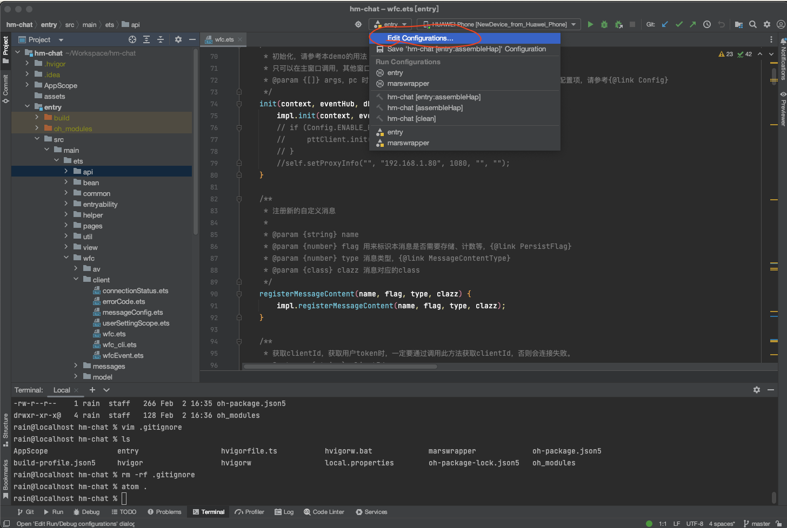
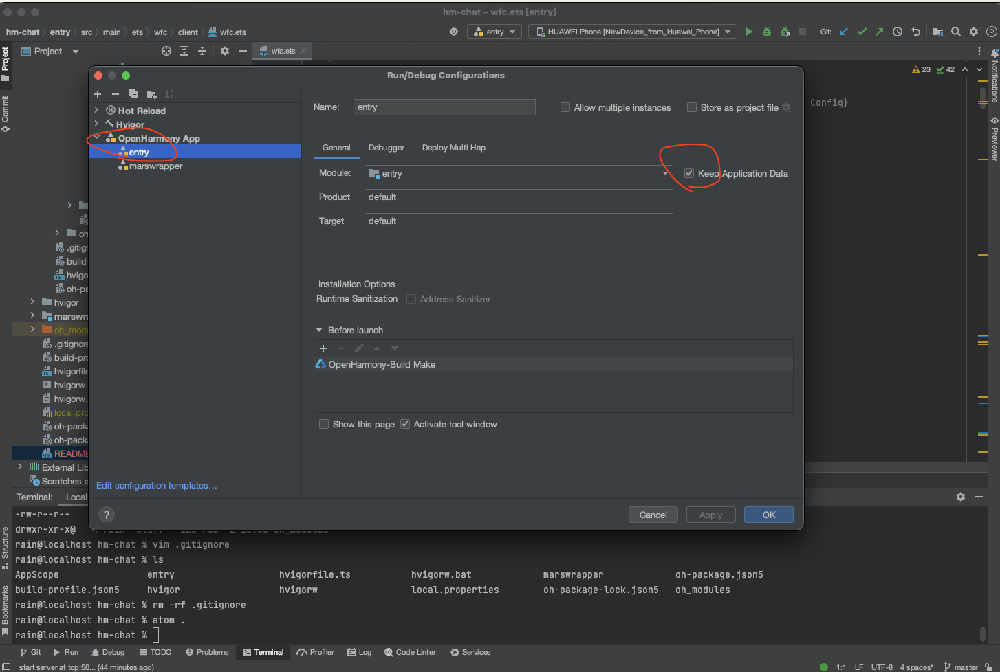
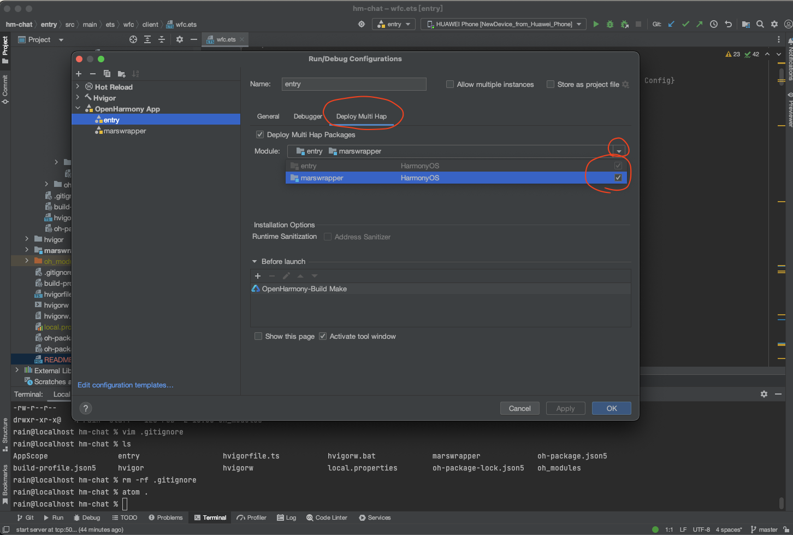
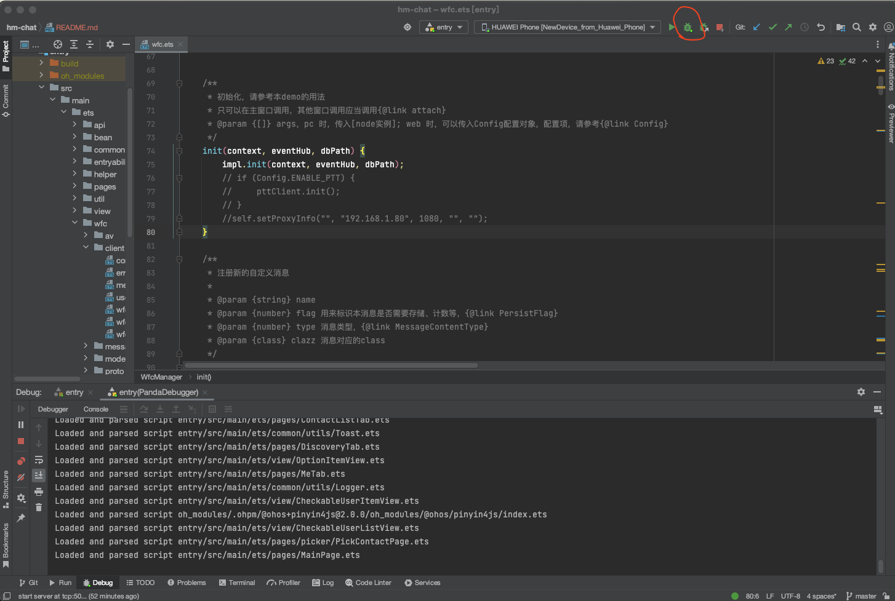

## 野火IM鸿蒙原生平台

野火IM是专业级即时通讯和实时音视频整体解决方案，由北京野火无限网络科技有限公司维护和支持。

主要特性有：私有部署安全可靠，性能强大，功能齐全，全平台支持，开源率高，部署运维简单，二次开发友好，方便与第三方系统对接或者嵌入现有系统中。详细情况请参考[在线文档](https://docs.wildfirechat.cn)。

主要包括一下项目：

| [GitHub仓库地址(主站)](https://github.com/wildfirechat)            | [码云仓库地址(镜像)](https://gitee.com/wfchat)                | 说明                                                             | 备注                      |
|--------------------------------------------------------------|-------------------------------------------------------|----------------------------------------------------------------|-------------------------|
| [im-server](https://github.com/wildfirechat/im-server)       | [im-server](https://gitee.com/wfchat/im-server)       | IM Server                                                      |                         |
| [android-chat](https://github.com/wildfirechat/android-chat) | [android-chat](https://gitee.com/wfchat/android-chat) | 野火IM Android SDK源码和App源码                                       | 可以很方便地进行二次开发，或集成到现有应用当中 |
| [ios-chat](https://github.com/wildfirechat/ios-chat)         | [ios-chat](https://gitee.com/wfchat/ios-chat)         | 野火IM iOS SDK源码和App源码                                           | 可以很方便地进行二次开发，或集成到现有应用当中 |
| [pc-chat](https://github.com/wildfirechat/vue-pc-chat)       | [pc-chat](https://gitee.com/wfchat/vue-pc-chat)       | 基于[Electron](https://electronjs.org/)开发的PC 端                   |                         |
| [web-chat](https://github.com/wildfirechat/vue-chat)         | [web-chat](https://gitee.com/wfchat/vue-chat)         | 野火IM Web 端, [体验地址](http://web.wildfirechat.cn)                 |                         |
| [wx-chat](https://github.com/wildfirechat/wx-chat)           | [wx-chat](https://gitee.com/wfchat/wx-chat)           | 小程序平台的Demo(支持微信、百度、阿里、字节、QQ 等小程序平台)                            |                         |
| [app server](https://github.com/wildfirechat/app_server)     | [app server](https://gitee.com/wfchat/app_server)     | 应用服务端                                                          |                         |
| [robot_server](https://github.com/wildfirechat/robot_server) | [robot_server](https://gitee.com/wfchat/robot_server) | 机器人服务端                                                         |                         |
| [push_server](https://github.com/wildfirechat/push_server)   | [push_server](https://gitee.com/wfchat/push_server)   | 推送服务器                                                          |                         |
| [docs](https://github.com/wildfirechat/docs)                 | [docs](https://gitee.com/wfchat/docs)                 | 野火IM相关文档，包含设计、概念、开发、使用说明，[在线查看](https://docs.wildfirechat.cn/) |                         |

野火IM 鸿蒙原生平台 Demo，演示如何将野火IM的能力集成到鸿蒙原生平台中。

## 前置说明

1. 本项目所使用的`libmarswrapper.so`是需要付费的，价格请参考[费用详情](https://docs.wildfirechat.cn/price/)
2. `libmarswrapper.so`支持试用，具体请看[试用说明](https://docs.wildfirechat.cn/trial/)
3. 本项目默认只能连接到官方服务，购买或申请试用之后，替换`libmarswrapper.so`，即可连到自行部署的服务

## 环境依赖
鸿蒙集成开发环境```DevEco-Studio```。可以创建和编译鸿蒙原生项目。

## 开发
使用```DevEco-Studio```打开本项目，运行之前海需要修改一下项目配置:
1. 打开项目运行配置

2. 打开保持应用数据

3. Deploy Multi Hap选择marswrapper

4. 运行


## 注意事项
1. 野火IM要求客户端和服务器之间的时间差不能太大，有时模拟器的时间会不准，导致无法正常工作。所以必须确保手机或者模拟器时间准确。

## 截图


## 遗留问题
目前还不支持实时音视频，我们还在寻找对接鸿蒙原生WebRTC的办法。demo上一些功能也不够完善。

## License

1. Under the Creative Commons Attribution-NoDerivs 3.0 Unported license. See the [LICENSE](https://github.com/wildfirechat/vue-chat/blob/master/LICENSE) file for details.
